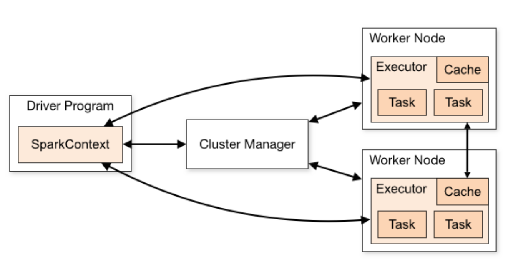

# NumPy

* Python provides built-in libraries for both multi-threading and multi-processing, with high level abstractions

* NumExpr and NumPy can speed-up Python codes through vectorisation and multithreading, Numba can even make use of OpenMP threading, if installed.
* Some libraries offer a “**njobs**” option, such as sci-kit learn, which uses multiprocessing to parallelize ML training, though scaling is limited in practice.
* The Python GIL prevents true multi-threaded parallelism
  * However, each Python process has its own GIL.
  * NumExpr and NumPy compile to native code, so avoid dealing with the GIL.

# Apache Spark

* **Apache Spark** is an engine for executing data engineering, data science, and machine learning on single-node machines or clusters (单机或集群都可以)
* Key features:
  * Streaming data
  * Analytics
  * Data science at Scale
  * Machine Learning

* Clusters:
  * Component: ① Driver Program ② Cluster Manager ③ Worker Nodes
  * 
  * Supported cluster manager: ① Hadoop YARN  ② Apache Mesos ③ Kubernetes 

### Why Apache Spark

* Focuses on computation. In-memory storage for intermediate computations
* APIs for multiple programming languages.  Java Scala Python SQL R
* Libraries for different type of workflows.

### How Spark operates?

* **Transformations** create a new Spark data frame without altering the original one. They can additionally be divided into:
  * ***Narrow transformations***, take a single input partition and return a single output partition (e.g. *filter operation*).
  * ***Wide transformations***, use multiple partitions and require reshuffling(重新洗牌) of the data (e.g. *groupby operation*).
* **Actions** are eagerly executed, and produce a value (e.g., the result of processing a series of **Transformations**). Example actions are “count”, “collect”, and “saveAsTextFile"

### Spark Data API 

* **Resilient Distributed Dataset (RDD)**
  * General purpose. 
  * ==**Represents data partitioned across cluster, operated on in parallel.**==
  * **Transparently** moves data around the cluster
  * More suitable for ==**unstructured**== data
  * Less optimized
  * ==**Immutable**.==  Computation arranged as graph of RDD transformations, each **creating a new one**
  * Persisted **in memory**(存在内存中) so lower disk I/O requirements
  * Supports reconstruction of lost data from source (efficient based on knowledge of computation graph)
* **DataFrame**
  * Tabular
  * Schema based
  * More suitable for==**structured data**==
  * **More optimized**
* **Dataset**
  * Combination of both

### Spark ML Library

* Spark makes possible to run Machine Learning workflows using their Spark ML library. This library can be divided into 4 key constituents:

  * **Transformers**: are mainly used to perform data engineering/pre-processing tasks (e.g.scaling, feature selection, etc…) and they just apply rule-based transformations (there is no learning from data). They take a **data frame** as input and return **a new data frame**.
  * **Estimators**: learn parameters from the data and return a trained ML model (which is a Transformer).

  * **Pipeline**: organizes a sequence of Transformers and Estimators in a single object.
  * **Evaluators**: used in order to assess our Machine Learning models through various classification, regression, etc… metrics.