# Linear Regression

## Types of Machine Learning

* **Supervised Learning**: where there is an input *X*, and an output *Y* and the task is to learn the mapping from the input to the output
  * **Classification**: when *Y* is a **categorical** variable (e.g. spam/not spam)
  * **Regression**:  when *Y* is a **continuous** variable.

* **Unsupervised Learning:** there is only input *X*. The aim is to find regularities/structure in the input space. One method is called *clustering*, where the aim is to find clusters or groupings of input.

## Linear Regression

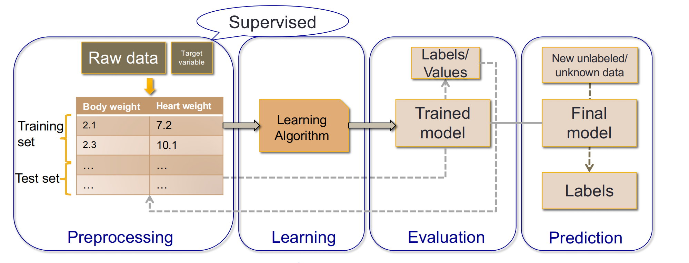

#### The model

In regression, we would like to write the numeric **output**, called the ==**dependent or response variable**==, as a function of the **input**, called the ==**independent or explanatory variable**==(also known as features).

#### Cost Function

* Least squares estimation
* 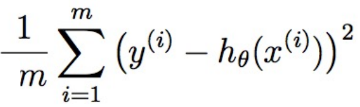

* 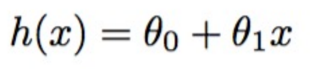

* Find the values of θ0 and θ1 which have minimum cost.
* θ0 is the intercept(截距) ; also referred to as bias in machine learning literature.
* θ1 is the slope of the line.

## Learning Process for Supervised learning

* Define model: 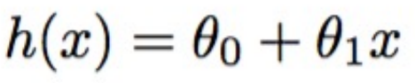

* Build the cost function: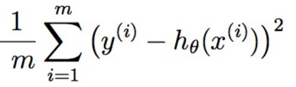

* Optimize the cost function to find the model’s parameters

  * Optimization algorithms: ① **Gradient**(斜率, 梯度) descent [梯度下降法]  ② **stochastic**(随机) gradient descent.

  * Normal equation (in linear and multiple regression)

* Evaluation of the model

#### Gradient descent optimization 

* Start with any initial values for parameters

* Changing parameters to reduce the cost

* Repeat until at the minimum

* We use the gradient to change parameters in the right direction so that cost is reduced.

  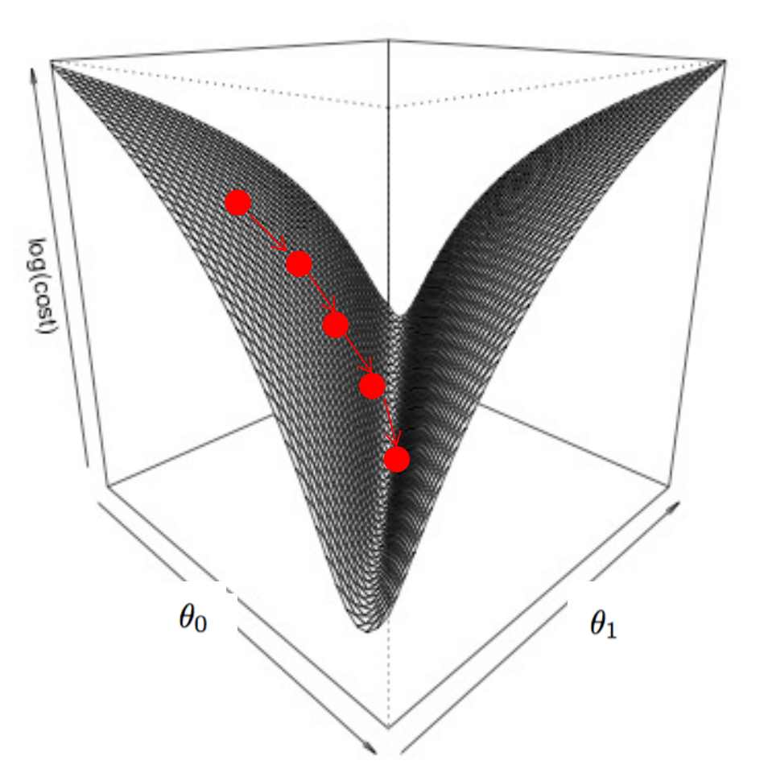

#### Gradient descent algorithm(梯度下降法)

* Parameter: θ0 , θ1
* Calculate: h(x) = θ0  + θ1 x
* The cost function is   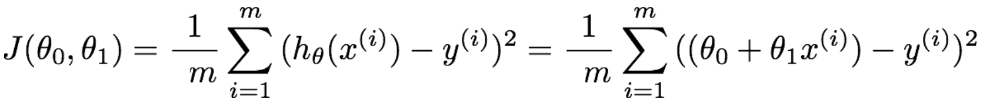

* Repeat until **convergence**(收敛)  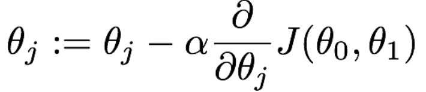

  All parameters are updated simultaneously

* α is  the learning rate and controls the size of the steps.

* Linear regression partial derivatives (偏导数)

* **Property**: 

  * Batch algorithm because each iteration looks at all the training data
  * Simultaneously update parameters according to partial derivatives
  * Can be slow to converge
  * Each iteration is slow processing all the training data
  * Feature scaling is a good idea
  * **Easily vectorized to use parallel linear algebra libraries that can exploit parallelism**

#### Stochastic gradient descent algorithm(随机梯度下降法)

* Randomly shuffle training data

* repeat {

  ​				for {

  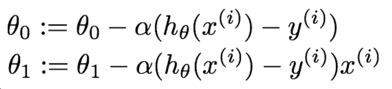

  ​					  }

  }

* Can scale algorithms to much bigger training sets

* May require few passes through training set (~1 to10)

* Very little scope for parallelism

#### Mini-batch gradient descent

Hybrid between batch (update after all *m* records) and stochastic (update after 1 record)

* Upgrade using batch algorithm every *b<m* training records

* Supports exploitation of vectorization and hence parallelism

#### Normal equations

* Analytic solution rather than iterative

* *n* features, *m* training records
* 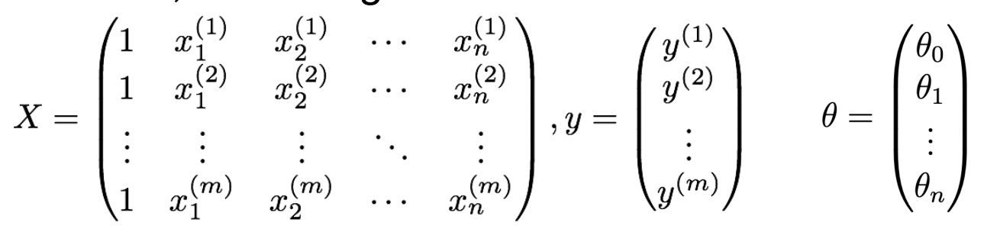

* X is called the design matrix
* Cost Function: 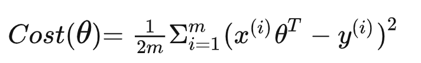 
  * Firstly, representing cost function as a matrix form: 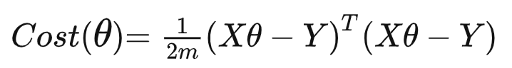
  * Simplify: 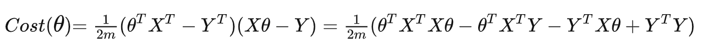
  * Now make use of multivariate calculus to find the partial derivative and make it equal to 0 in all directions. Then, we can get the θ we want.
* https://zhuanlan.zhihu.com/p/60719445  推导过程

#### Comparison of Gradient descent and normal equation

* *n* features, *m* training records
* Gradient descent
  * Need to choose α
  * Iterative
  * Works for large *n*
  * Used with many learning algorithms
* Normal equation
  * No need to choose α
  * No iterations required
  * Inverting *n × n* matrix can be slow for large *n* 
  * Only works with linear regression