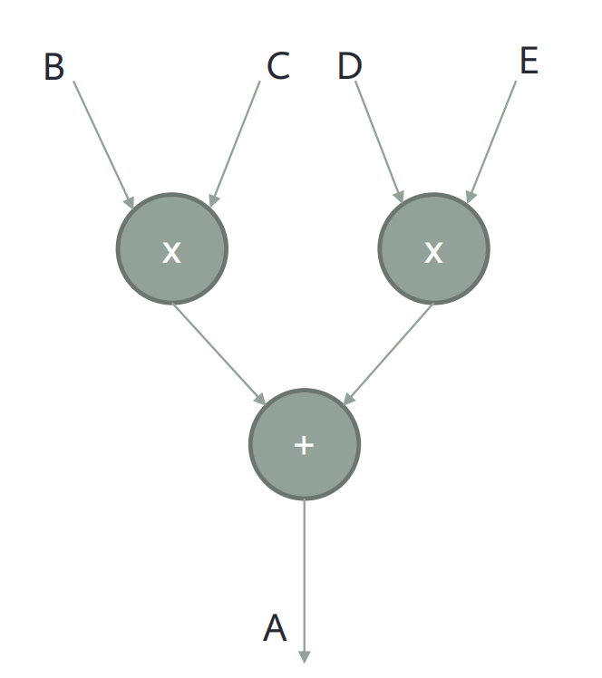

# Optimisation1

### Constant folding 

* Where possible, replace variables with constants at compile time.
* Benefits:
  * Reduces memory references (value stored in instruction, rather than in data).
  * Expressions that only involve constants **can be evaluated at compile time**
  * Take care with expressions which might result in errors (overflow, divide by zero)
  * For floating point, must ensure that compiler will generate same results as executed code.


### Algebraic simplifications

* Compiler can recognize and simplify algebraic expressions.
* Examples:  ① i + 0 -> i     ② i * 0 -> 0   ③ i ** 2 -> i * I  ④ (I - J) + (I - J) + (I - J) -> 3 * I - 3 * J 


### Copy propagation

* Given an assignment (**x=y**), we can replace later uses of **x** with **y**, provided no changes to either **x** or 

  **y** have occurred in the meantime.

* ```
  x = y;  								  x = y;
  c = x + 3;        ===>   	c = y + 3;
  d = x + y;   							d = y + y;
  ```

* ==Benefits==: Can reduce memory references, or number of registers required


### Constant propagation

* If a variable **x** is assigned a constant value, then subsequent references to **x** can be replaced by the constant, provided no changes to **x** occur in the meantime. (假如x值在这期间没有被改变)

* ==Benefits==: Reduce the number of registers required.

* ```
  x = 4;									  x = 4;
  c = x + 3;			  ===> 		c = 4 + 3;
  d = x + y; 								d = 4 + y;
  ```


### Redundancy elimination

* removing redundant computations.
* 


# Instruction scheduling optimizations

### Introduction 

* It is important to remember that compiler is making transformations at level of individual machine instructions

* ==Why instruction scheduling is important?==

  * Compiler code-generator translates **IR(intermediate Representation)** into sequences of hardware instructions

  * Most modern processors use register/load-store instruction sets, load/store operations go between registers and memory.

  * Most instructions take many cycles to complete but are pipelined

    * Processor can continue to issue new instruction until it needs to use the result of an incomplete operation 

      (pipeline stalls waiting for source register to become ready)

* Dependency graph
  * **Values** in registers represent the dependencies between instructions (forms a graph)
  * Instructions can be issued in any order that preserves dependency order.
  * Compiler wants to choose schedule to leave enough time between issue and result-use to ==**prevent pipeline stall**==
  * A = (B * C) + (D * E).   Instructions are nodes, Value(Registers) are vertexes.



### Loop unrolling

* Problem: Loops with small bodies generate small basic blocks of assembly code
  * lot of dependencies between instructions
  * high branch frequency
  * little scope for good **instruction scheduling**
* The above is why we need loop unrolling. Loop unrolling is a technique for increasing the size of the loop body
  * gives more scope for better schedules
  * reduces branch frequency
  * make more independent instructions available for multiple issue.
* Details:
  * Replace loop body by multiple copies of the body
  * Modify loop control, but remember to take care of arbitrary loop bounds
  * Number of copies is called ==**unroll factor**==
  * 


# Data cache optimization 

