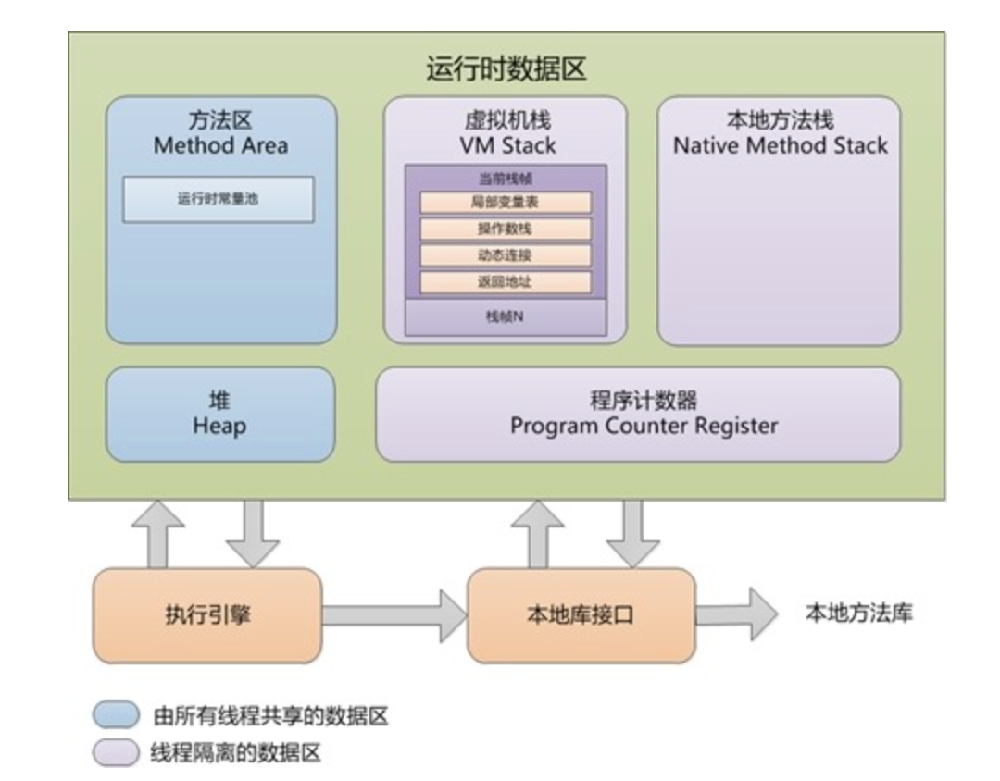

# What is memory management in Java

* In C, C++, we programers need to keep watch of memory allocation.
* In Java, Garbage Collector has the duty of memory deallocation handling and it runs automatically.

# JVM Memory Structure

* 

* https://seagence.com/blog/memory-management-java/
* https://docs.oracle.com/javase/specs/jvms/se8/html/jvms-2.html#jvms-2.5.4
* https://www.yuque.com/u21195183/jvm/nbkm46

#### Heap Memory

* Shared runtime data area that can be allocated to all objects and arrays, including class objects. 
* VM options to configure head size:
  * Maximum Java heap size: -Xmx
  * Initial Java heap size: -Xms

#### JVM Stack Area

* Private.

* A stack is created simultaneously with the creation of a thread. 
* **Fixed Size**. If the computation in a thread requires a larger Java Virtual Machine stack than is permitted, the Java Virtual Machine throws a `StackOverflowError`
* **Auto expanded size**. If Java Virtual Machine stacks can be dynamically expanded, and expansion is attempted but insufficient memory can be made available to effect the expansion, or if insufficient memory can be made available to create the initial Java Virtual Machine stack for a new thread, the Java Virtual Machine throws an `OutOfMemoryError`.

##### Stack Frame contains

* Local Variable array 本地变量表   
* Frame Data 
* Operand Stack  操作数栈
* Dynamic linking

* The sizes of LVA, FD and OS are **determined at the compile time** 
* 每个线程只能有一个活动栈帧（current frame, active frame) ，对应着当前正在执行的那个方法.

##### Does GC involve JVM Stack Area?

* No. The memory on the stack contains **method-parameters** and **local variables** (to be precise: the references for objects and variables itself for primitive types). **The memory will be automatically removed if you leave the method**.

##### Is local variables thread safe?

* Every thread has its own JVM stack and never share its stack with other thread.

* But local references to objects are a bit different. The reference itself is not shared. The object referenced however, is not stored in each threads's local stack. All objects are stored in the shared heap. 

  **①** If an object created locally never escapes the method it was created in, it is thread safe.  

  **②** But if it escapes from the method, we need to consider thread safe.

#### Program counter (PC) register 

* Private 

* Storing the address of the next instruction.

* No GC and OOM

* Why we need it

  *  There are many threads in JVM,  context switch will frequently happen, with PC register, CPU know where to execute.

  *  Context Switch: In computing, a context *switch* is the process of storing the state of a process or *thread*, so that it can be restored and resume execution at a later point.
  * 

#### Method Area

* Create as JVM starts up.
* The size of method area determine how many classes can be stored, if there are too many classes in system, memory can not be made available to satisfy memory allocation, **JVM will throws OOM**
  * 加载大量第三方jar包。 Tomcat部署工程过多。 大量动态的生成反射类。
* 元空间: metaspace  永久代: PermGen  Permanent Generation  
  * Diff: https://www.baeldung.com/java-permgen-metaspace