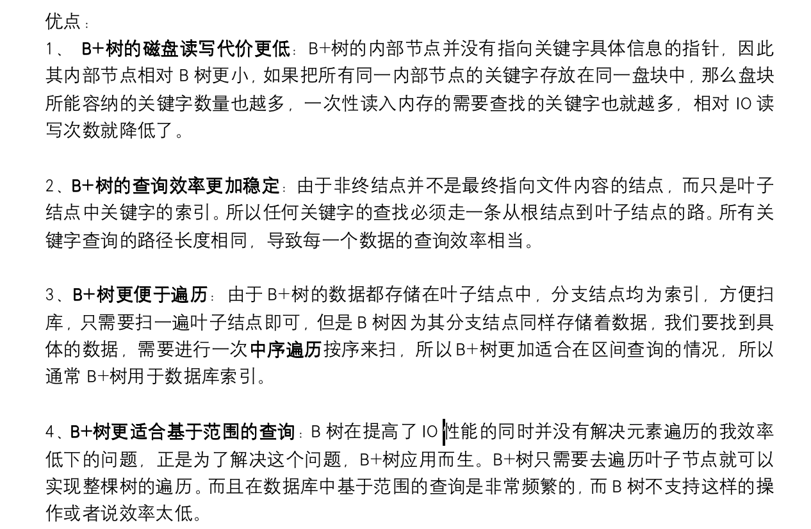

https://zhuanlan.zhihu.com/p/149287061

# B+ Tree

https://en.wikipedia.org/wiki/B%2B_tree

https://byjus.com/gate/b-plus-tree-in-dbms-notes/

http://blog.codinglabs.org/articles/theory-of-mysql-index.html  这个复习的时候再看几遍

### Features

* All records are only stored in **leaf nodes**,  **internal nodes** are **used for searching leaf nodes. **(所有数据都在叶子节点， 中间结点用来搜索).   **More Branching** of internal nodes helps to reduce the height of tree. (中间结点的分支越多，或者说孩子越多，树的高度就越小)
* All leaf nodes are at the same height, and are linked sequentially by a **linked list**  (叶子结点的高度一致, 且所有叶子结点由一个链表连起来)
* **Order** or **branching factor**. The maximum allowed number of direct child nodes.    (树的阶, 最大孩子数)
* 具体的节点的关系看wiki百科

### Pros

* The query is **stable**, Records can be retrieved in an equal number of disks access.    Reason: all leaf nodes at same height
* **Low cost** of disk read and write.     Reason: Internal nodes don't store the data, only pointer.
* The number of disk I/O is low.      Reason: The height of tree is low
* Better for **Range query**.    Reason: Linked List in leaf nodes.

### Database Related 

* One Node memory size is equal to one page size.

# clustered index 

